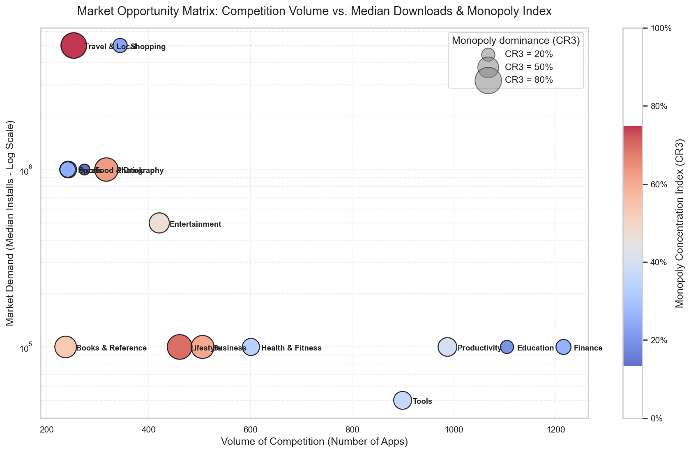
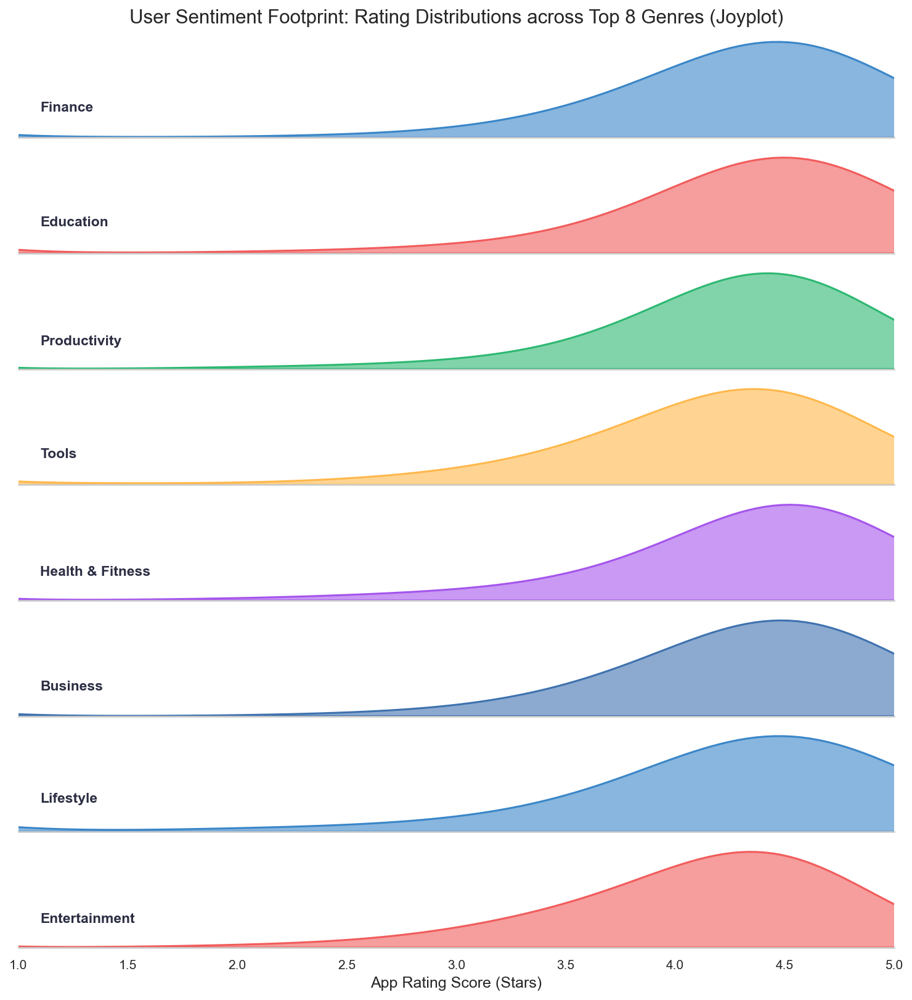
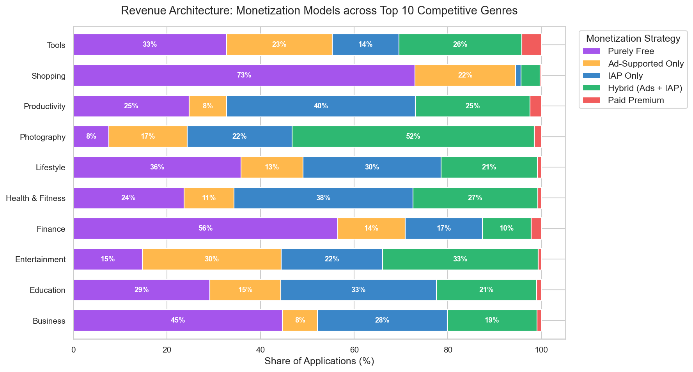
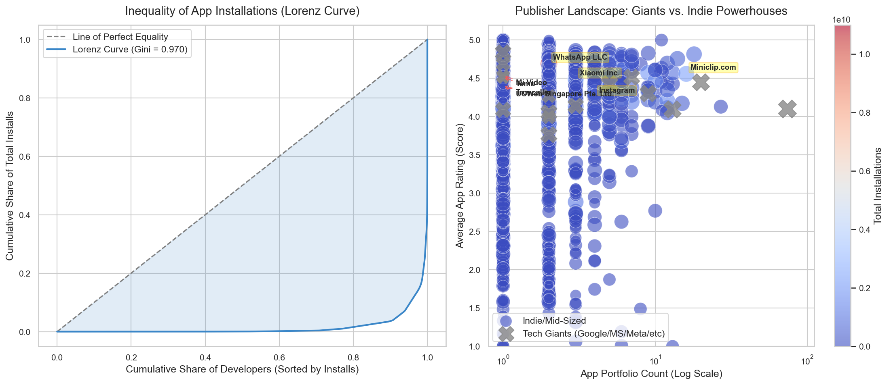
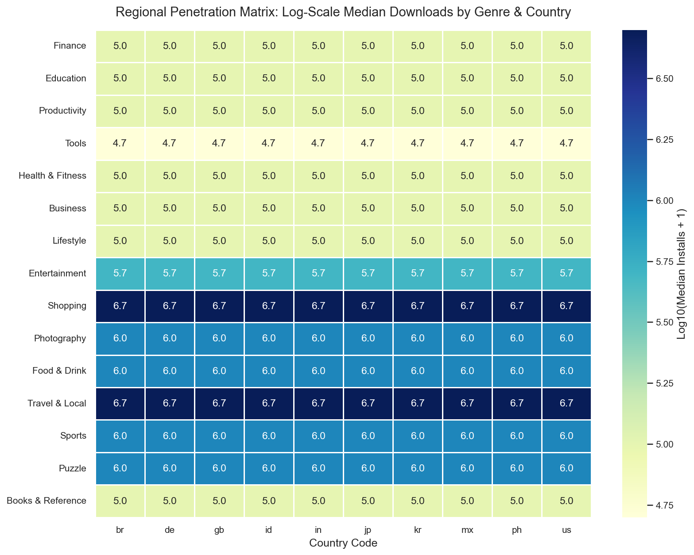
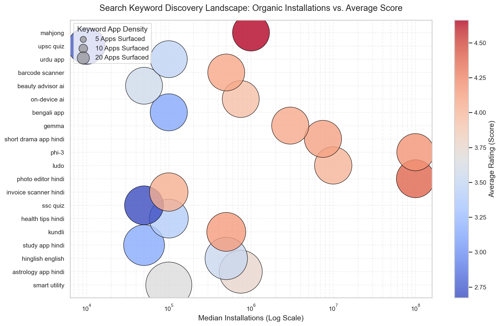

# Google Play Store 2026 App Data Analysis

This directory contains the completed exploratory analysis for the fresh 2026 Google Play Store scrape. The dataset covers 11,176 unique apps discovered across 10 priority markets:

```text
us, in, br, id, mx, gb, de, jp, kr, ph
```

The notebook is designed as the publishable analysis artifact, while `visualizations.py` keeps the charting code separate and reusable.

## Files

| File | Purpose |
|------|---------|
| `google_play_store_app_data_analysis_2026.ipynb` | Main pre-executed analysis notebook |
| `visualizations.py` | Plotly, matplotlib, and seaborn chart functions used by the notebook |
| `images/` | Exported PNG versions of the six main figures |
| `README.md` | Guide to the analysis and figures |

## Data Used

The notebook reads local CSV files from `../data/scraped_2026/`:

| File | Rows | Notes |
|------|------|-------|
| `apps.csv` | 11,176 | One row per unique app; no duplicate `app_id` values found |
| `app_country_stats.csv` | 111,307 | Country-level app stats across the 10 target markets |
| `discovery_signals.csv` | 75,812 | Search, chart, collection, and country discovery signals |

About 2,245 apps have missing ratings, which is expected for unrated or low-activity listings. The analysis keeps those apps for market-volume and install analysis, while rating-specific sections automatically use rated apps only.

The extraction pipeline supports a configurable install threshold through `MIN_INSTALLS`, but this saved 2026 dataset was exported with lower-install apps included. In this snapshot, 7,223 apps have at least 100,000 installs, 3,922 apps are below 100,000 installs, and 31 apps have missing install values. Conclusions should therefore be read as analysis of the discovered 2026 sample rather than analysis of only 100,000+ install apps or the entire Play Store.

Install coverage in this snapshot:

| Install group | App count |
|---------------|-----------|
| 100,000+ installs | 7,223 |
| Below 100,000 installs | 3,922 |
| Missing install values | 31 |

## Analysis Structure

1. Market structure and genre competition
2. Ratings and quality patterns
2.5. Content rating and audience segmentation
3. Monetization strategy
4. Developer concentration and indie opportunities
5. Country and regional demand
6. Discovery and keyword intelligence
7. App freshness and update recency
8. Follow-up opportunity analysis (Chapters 10.1–10.4)
9. Combined master opportunity dashboard (Chapter 11)
10. Strategic conclusions

## Key Findings

The follow-up analysis in Chapters 10–11 surfaces several practical opportunity signals:

- The low-install opportunity pool contains 700 apps under 100,000 installs with strong rating signals. Examples surfaced by the ranking include `MyMoney Pro - Expense & Budget`, `Background Eraser: Remove BG`, and `AI Resume Builder & CV Maker`.
- Genres with the strongest demand-adjusted opportunity scores include `Word`, `Racing`, `Arcade`, `Action`, and `Card`, based on median installs, app count, publisher concentration, and rating quality.
- Country discovery signals over-index for `Maps & Navigation` in markets such as `ph`, `jp`, `kr`, and `de`; `Communication` and `Music & Audio` also show strong country-specific discovery lift in selected markets.
- High-quality keyword surfaces include `phonepe`, `whatsapp`, `gpay`, `meesho`, and `photo editor espanol`, though these should be reviewed carefully because some are competitor or brand-adjacent keywords.
- Content rating segmentation shows that `Everyone` apps dominate in count but `Teen` and `Mature 17+` titles show higher install efficiency in several genres — useful for targeting decisions.
- App freshness analysis (Chapter 7) buckets apps by days since last update. Recently updated apps (under 90 days) tend to have higher scores and stronger discovery presence, confirming that active maintenance is correlated with quality signals.
- The combined master opportunity dashboard (Chapter 11) ranks apps by a composite score that weights promise, genre opportunity, keyword reach, and country breadth — surfacing the most actionable targets across all signals.

## Figure Guide

### Figure 1: Market Opportunity Matrix

**File:** `images/figure1_market_volume.png`



Compares each top genre by app count, median installs, and concentration ratio. This is used to separate saturated categories from categories with better demand-to-competition balance.

**Main takeaway:** Finance, Education, Productivity, and Tools are highly crowded, while some smaller genres can still show stronger install potential.

### Figure 2: Rating Density Ridges

**File:** `images/figure2_ratings_quality.png`



Shows score distributions for the top genres, making it easier to see which categories have consistently high user sentiment and which are more polarized.

**Main takeaway:** Ratings tend to cluster in the upper range, but category-level quality patterns differ enough that genre-specific benchmarks are more useful than one global average.

### Figure 3: Monetization Mix

**File:** `images/figure3_monetization.png`



Breaks top genres into monetization models: purely free, ad-supported, IAP-only, hybrid ads plus IAP, and paid premium.

**Main takeaway:** Free apps dominate the sample at about 97.7%, so the practical monetization question is usually which free-app model fits the category, not whether to launch paid-only.

### Figure 4: Publisher Landscape

**File:** `images/figure4_developer_lorenz.png`



Combines a Lorenz curve for install concentration with a developer scatter plot that separates large publishers from indie and mid-sized powerhouses.

**Main takeaway:** Installs are heavily concentrated, so opportunity analysis should look for defensible niches, regional openings, and strong smaller publishers rather than only aggregate category size.

### Figure 5: Regional Demand Matrix

**File:** `images/figure5_regional_comparison.png`



Maps median installs by genre and country, using the 10 scraped markets.

**Main takeaway:** Regional demand varies by category, so localization and country prioritization should be part of the opportunity strategy.

### Figure 6: Keyword Discovery Landscape

**File:** `images/figure6_discovery_signals.png`



Connects keyword discovery with median installs, average score, and app density.

**Main takeaway:** Keywords that surface many apps are not automatically the best opportunities; stronger targets combine meaningful demand, quality signals, and manageable competition.

## Figure Guide (new chapters)

### Content Rating Analysis
**File:** `images/content_rating_analysis.png`

Breaks app count, score, and install efficiency by content rating (Everyone, Teen, Mature 17+, Everyone 10+) and shows how genre mix differs across audience segments.

### App Freshness Analysis
**File:** `images/app_freshness_analysis.png`

Buckets apps by days since last update (`<90 days`, `90–180`, `180–365`, `1–2 years`, `2+ years`) and compares score, ratings, and install distributions across freshness tiers.

### Master Opportunity Dashboard
**File:** `images/master_opportunity_dashboard.png`

Scatter plot of every low-install promising app on two axes — genre opportunity score vs individual app promise score — coloured by keyword count. The top-right quadrant highlights apps that combine strong individual signals with a high-opportunity genre context.

## Notes

- Data files are intentionally stored under `data/` and ignored by Git.
- The notebook uses relative paths, so run it from inside this directory.
- The Tapive dataset analysis is separate and lives in `../google_play_store_analysis_tapivedotcom/`.
- Enhanced Excel versions of the three data files (with auto-filters, charts, and dashboards) are available in `../data_my_copy/scraped_2026/` and can be regenerated via `python enhance_excel.py` from the project root.
